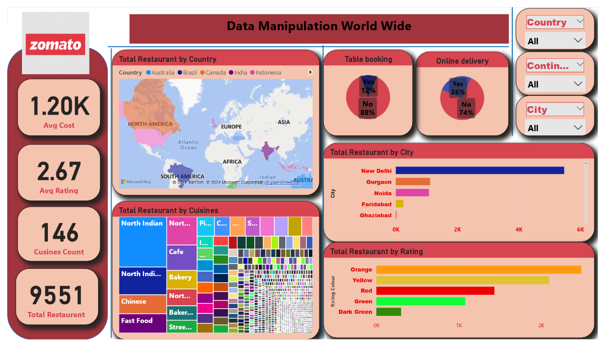

# 🍽️ Zomato Data Visualization – Power BI  

## 📌 Problem Statement  
Restaurant aggregators like Zomato manage **millions of listings worldwide**.  
This dashboard provides insights into **restaurant distribution, cuisines, ratings, and customer preferences**, helping businesses & customers make informed decisions.  

---

## 📂 Data Overview  
- Dataset: Global Zomato restaurant listings  
- Contains: Country, City, Cuisines, Ratings, Avg Cost, Online Delivery, Table Booking  

---

## 📊 Key Metrics  
- **Total Restaurants:** 9,551  
- **Average Cost for Two:** 1.20K  
- **Average Rating:** 2.67  
- **Cuisines Covered:** 146  
- **Online Delivery:** 26% restaurants  
- **Table Booking:** 12% restaurants  

---

## 📌 Dashboard Insights  

1. **Country-wise Distribution**  
   - India dominates with the highest number of restaurants  
   - Other countries include Australia, Brazil, Canada, Indonesia  

2. **City-wise Distribution**  
   - New Delhi, Gurgaon, Noida, Faridabad, and Ghaziabad have the highest density of restaurants  

3. **Cuisines Analysis**  
   - North Indian, Chinese, Fast Food, Café, and Bakery are most popular  

4. **Customer Preferences**  
   - Online delivery available in 26% listings  
   - Only 12% of restaurants offer table booking  

---

## 📈 Business Impact  
- 📊 Helps **investors** identify potential markets  
- 🍴 Guides **restaurants** to focus on popular cuisines & services  
- 📍 Enables **location strategy** for expansion  

---

## 🖼️ Dashboard Preview  

### Page 1 – Restaurant Overview  
  

---

## ⚙️ Tech Stack  
- **Power BI Desktop** – Dashboard creation  
- **DAX** – Custom KPIs for Avg Cost, Avg Rating  
- **Geospatial Visuals** – Map integration for location insights  

---

